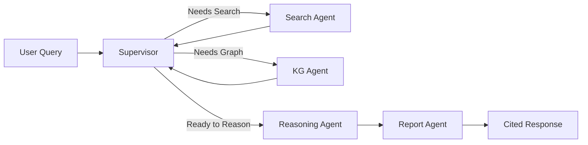

<div align="center">

# 🧠 EKIP

### Enterprise Knowledge Intelligence Platform

**A production-grade AI knowledge system powered by hierarchical multi-agent orchestration,<br>Knowledge Graph reasoning, and hybrid semantic search.**

[](https://python.org)
[](https://fastapi.tiangolo.com)
[](https://react.dev)
[](https://typescriptlang.org)
[](https://langchain-ai.github.io/langgraph/)
[](https://tailwindcss.com)
[](https://docs.docker.com/compose/)
[](#license)

<br>

**EKIP is not a chatbot.** It's an autonomous AI knowledge worker that intelligently orchestrates<br>multiple specialized agents to answer complex enterprise questions with grounded, cited responses.

---

</div>

## ✨ Key Features

<table>
<tr>
<td width="50%">

### 🤖 Multi-Agent Orchestration
LangGraph-powered supervisor agent dynamically routes queries to specialized agents — Search, Knowledge Graph, Reasoning, and Report — for intelligent divide-and-conquer problem solving.

### 🔗 Knowledge Graph Reasoning
Neo4j Aura-backed entity relationship graph enables traversal-based discovery: find service dependencies, team ownership, cross-functional relationships, and architectural impact chains.

### 🔍 Hybrid Semantic Search
Dense + sparse vector retrieval with Reciprocal Rank Fusion (RRF) via Qdrant Cloud. Combines embedding similarity with keyword precision for best-of-both-worlds document retrieval.

</td>
<td width="50%">

### 📄 Multi-Format Document Intelligence
Ingest PDF, DOCX, Markdown, CSV, HTML, and JSON with automatic chunking, embedding, and entity extraction. Documents are simultaneously indexed in vector store and knowledge graph.

### 🧠 Long-Term Semantic Memory
Persistent memory layer learns user query patterns, preferences, and context over time — enabling increasingly personalized and contextually relevant responses.

### 📊 Interactive Knowledge Explorer
React Flow-powered interactive graph visualization with real-time node exploration, relationship traversal, architecture mapping, and dependency impact analysis.

</td>
</tr>
</table>

---

## 🏗️ Architecture

```
                                    ┌─────────────────────────────┐
                                    │      React Dashboard        │
                                    │  (TypeScript + Vite + TW4)  │
                                    └──────────────┬──────────────┘
                                                   │ REST API
                                    ┌──────────────▼──────────────┐
                                    │     FastAPI Gateway          │
                                    │  (Auth · CORS · Rate Limit) │
                                    └──────────────┬──────────────┘
                                                   │
                                    ┌──────────────▼──────────────┐
                                    │   🎯 Supervisor Agent       │
                                    │    (LangGraph Orchestrator)  │
                                    └──┬────┬────┬────┬───────────┘
                                       │    │    │    │
                          ┌────────────┘    │    │    └────────────┐
                          ▼                 ▼    ▼                ▼
                   ┌─────────────┐  ┌──────────┐ ┌──────────┐ ┌──────────┐
                   │ 🔍 Search   │  │ 🔗 KG    │ │ 🧠 Reason│ │ 📝 Report│
                   │   Agent     │  │  Agent   │ │   Agent  │ │   Agent  │
                   └──────┬──────┘  └────┬─────┘ └──────────┘ └──────────┘
                          │              │
                   ┌──────▼──────┐  ┌────▼─────┐
                   │  Qdrant     │  │  Neo4j   │
                   │  Cloud      │  │  Aura    │
                   │(Vector DB)  │  │(Graph DB)│
                   └─────────────┘  └──────────┘
                          │              │
                   ┌──────▼──────────────▼─────┐
                   │      Supabase             │
                   │  (PostgreSQL + Auth +     │
                   │   Storage + RLS)          │
                   └───────────────────────────┘
```

### Agent Workflow



The **Supervisor** uses conditional routing to determine which specialized agents to invoke based on query analysis. Search and KG agents loop back for multi-hop information gathering before the Reasoning agent synthesizes findings into a cited report.

---

## 🛠️ Tech Stack

| Layer | Technology | Purpose |
|:------|:-----------|:--------|
| **Frontend** | React 19 · TypeScript · Vite · Tailwind CSS v4 | Interactive dashboard with dark theme |
| **UI Components** | React Flow · Lucide Icons · React Hot Toast | Graph visualization & notifications |
| **State Management** | Zustand · TanStack React Query | Client state & server state caching |
| **Backend** | Python 3.12 · FastAPI · Pydantic v2 | High-performance async API server |
| **AI Orchestration** | LangGraph · LangChain | Multi-agent workflow engine |
| **Primary LLM** | Google Gemini API (`gemini-2.0-flash`) | Query understanding & response generation |
| **Secondary LLM** | Groq API (`llama-3.3-70b-versatile`) | Fallback & specialized tasks |
| **Vector Database** | Qdrant Cloud | Hybrid dense + sparse semantic search |
| **Graph Database** | Neo4j Aura | Knowledge graph storage & Cypher queries |
| **Relational DB** | Supabase (PostgreSQL) | User data, auth, document metadata |
| **Embeddings** | FastEmbed (`text-embedding-004`) | Local embedding generation |
| **DevOps** | Docker Compose · Makefile | One-command development environment |

---

## 📁 Project Structure

```
ekip/
├── backend/                       # Python FastAPI Server
│   ├── app/
│   │   ├── agents/                # LangGraph Multi-Agent System
│   │   │   ├── supervisor/        #   ↳ Orchestrator with conditional routing
│   │   │   ├── search/            #   ↳ Hybrid vector search (Qdrant)
│   │   │   ├── knowledge_graph/   #   ↳ Neo4j Cypher query agent
│   │   │   ├── reasoning/         #   ↳ Evidence synthesis & analysis
│   │   │   ├── report/            #   ↳ Cited response generation
│   │   │   ├── ingestion/         #   ↳ Document processing pipeline
│   │   │   ├── graph.py           #   ↳ StateGraph assembly
│   │   │   └── state.py           #   ↳ Shared agent state schema
│   │   ├── api/v1/                # REST API Endpoints
│   │   ├── core/                  # Config, logging, exceptions
│   │   ├── db/                    # Database clients (Qdrant, Neo4j, Supabase)
│   │   ├── llm/                   # LLM provider abstraction layer
│   │   ├── middleware/            # CORS, rate limiting, request logging
│   │   ├── schemas/               # Pydantic request/response models
│   │   └── services/              # Business logic layer
│   ├── seeds/                     # Demo dataset (AcmeAI Technologies)
│   ├── main.py                    # FastAPI application entrypoint
│   ├── pyproject.toml             # Python dependencies & build config
│   └── Dockerfile
│
├── frontend/                      # React TypeScript Dashboard
│   ├── src/
│   │   ├── pages/
│   │   │   ├── QueryWorkspace     # AI query interface with streaming
│   │   │   ├── KnowledgeGraphPage # Interactive graph explorer
│   │   │   ├── ArchitecturePage   # System architecture visualization
│   │   │   ├── ImpactAnalysisPage # Dependency impact analysis
│   │   │   ├── DocumentsPage      # Document management & upload
│   │   │   └── DiagnosticsPage    # System health & metrics
│   │   ├── components/            # Shared UI components
│   │   ├── services/              # API client layer
│   │   └── types/                 # TypeScript type definitions
│   ├── index.html
│   ├── package.json
│   └── vite.config.ts
│
├── docker-compose.yml             # Full-stack Docker orchestration
├── Makefile                       # Developer workflow commands
├── .env.example                   # Environment variable template
└── .gitignore
```

---

## 🚀 Getting Started

### Prerequisites

| Requirement | Minimum Version |
|:------------|:----------------|
| Python | 3.12+ |
| Node.js | 20+ |
| Supabase | Cloud account |
| Qdrant | Cloud account |
| Neo4j | Aura account |
| Gemini | API key |
| Groq | API key |

### Local Development

#### 1. Clone & Configure

```bash
git clone https://github.com/Snigdha-Gayathri/EKIP.git
cd EKIP

# Copy environment template and fill in your API keys
cp .env.example .env
```

#### 2. Backend Setup

```bash
cd backend
pip install -e ".[dev]"
uvicorn main:app --host 0.0.0.0 --port 8000 --reload
```

The API server will be available at `http://localhost:8000` with interactive docs at `/docs`.

#### 3. Frontend Setup

```bash
cd frontend
npm install
npm run dev
```

The dashboard will be available at `http://localhost:5173`.

#### 4. Seed Demo Data

```bash
cd backend
python -m seeds.seed_all
```

This populates all three databases with the **AcmeAI Technologies** demo dataset.

### Docker (One-Command Setup)

```bash
docker-compose up --build
```

This starts both backend (`port 8000`) and frontend (`port 5173`) with hot-reload enabled.

### Deployment to Render

For production deployment on Render, see the comprehensive [**Deployment Guide**](DEPLOYMENT.md).

Quick deployment steps:
1. Push your code to GitHub
2. Connect your repository to Render
3. Configure environment variables in Render dashboard
4. Deploy using the included `render.yaml` configuration

See [DEPLOYMENT.md](DEPLOYMENT.md) for detailed instructions, environment variable setup, and troubleshooting.

---

## ⚡ Makefile Commands

```bash
make dev          # Start full stack via Docker Compose
make backend      # Start backend only
make frontend     # Start frontend only
make install      # Install all dependencies (Python + Node)
make seed         # Seed demo data
make test         # Run all tests (pytest + vitest)
make lint         # Run linters (ruff + eslint)
make typecheck    # Run type checkers (mypy + tsc)
make clean        # Remove build artifacts & caches
```

---

## 🔧 Environment Variables

<details>
<summary><b>Click to expand full configuration reference</b></summary>

```env
# ── Application ──
APP_NAME=EKIP
APP_ENV=development
APP_DEBUG=true
APP_LOG_LEVEL=INFO
APP_SECRET_KEY=<random-secret>
CORS_ORIGINS=http://localhost:5173,http://localhost:3000

# ── Supabase ──
SUPABASE_URL=https://your-project.supabase.co
SUPABASE_ANON_KEY=<your-anon-key>
SUPABASE_SERVICE_ROLE_KEY=<your-service-role-key>
SUPABASE_JWT_SECRET=<your-jwt-secret>
DATABASE_URL=postgresql://postgres:<password>@db.<project>.supabase.co:5432/postgres

# ── Qdrant Cloud ──
QDRANT_URL=https://your-cluster.qdrant.io:6333
QDRANT_API_KEY=<your-qdrant-api-key>
QDRANT_COLLECTION_DOCUMENTS=ekip_documents
QDRANT_COLLECTION_MEMORY=ekip_memory

# ── Neo4j Aura ──
NEO4J_URI=neo4j+s://your-id.databases.neo4j.io
NEO4J_USERNAME=neo4j
NEO4J_PASSWORD=<your-neo4j-password>
NEO4J_DATABASE=neo4j

# ── LLM: Gemini (Primary) ──
GEMINI_API_KEY=<your-gemini-api-key>
GEMINI_MODEL=gemini-2.0-flash
GEMINI_EMBEDDING_MODEL=text-embedding-004

# ── LLM: Groq (Secondary) ──
GROQ_API_KEY=<your-groq-api-key>
GROQ_MODEL=llama-3.3-70b-versatile

# ── Features ──
ENABLE_STREAMING=true
ENABLE_MEMORY=true
ENABLE_GRAPH_VISUALIZATION=true
MAX_UPLOAD_SIZE_MB=50
```

</details>

---

## 💬 Example Queries

Once the system is running with demo data, try these queries to see the multi-agent system in action:

| Query | Agents Activated |
|:------|:-----------------|
| *"How do we deploy the Authentication Service?"* | Search → Report |
| *"Which team owns the Payments Service and what does it depend on?"* | Search + KG → Reasoning → Report |
| *"What would break if we took down the API Gateway?"* | KG (impact traversal) → Reasoning → Report |
| *"Summarize the onboarding process for new developers"* | Search → Reasoning → Report |
| *"Show me the architecture of the ML Pipeline"* | KG → Report |
| *"Which customer reported Bug #154 and what service was affected?"* | Search + KG → Report |

---

## 🏢 Demo Dataset — AcmeAI Technologies

EKIP ships with a comprehensive synthetic enterprise dataset for **AcmeAI Technologies**, a fictional AI/ML platform company:

- **👥 500+ employees** across 8 engineering teams
- **🔧 15+ microservices** in a Kubernetes architecture
- **📦 3 products** — Studio, Gateway, Analytics
- **📄 100+ documents** — runbooks, RFCs, onboarding guides, API specs
- **🔗 500+ knowledge graph relationships** — team ownership, service dependencies, document authorship

Seed with: `python -m seeds.seed_all`

---

## 📐 Design Decisions

| Decision | Rationale |
|:---------|:----------|
| **LangGraph over CrewAI/AutoGen** | First-class support for conditional routing, shared state, and cyclical agent loops. Supervisor pattern enables fine-grained orchestration. |
| **Qdrant Cloud over Pinecone** | Native hybrid search (dense + sparse vectors) with RRF fusion without middleware. Self-hostable for enterprise deployments. |
| **Neo4j Aura over in-memory graph** | Production-grade Cypher query language, ACID transactions, and native graph algorithms for impact analysis and path finding. |
| **Supabase over raw PostgreSQL** | Built-in auth, storage, RLS policies, and real-time subscriptions. Reduces boilerplate for enterprise auth flows. |
| **Zustand over Redux** | Minimal boilerplate, TypeScript-first, and excellent devtools. Perfect for medium-complexity state without Redux ceremony. |
| **FastEmbed over OpenAI Embeddings** | Local embedding generation eliminates API latency and cost. Supports multiple model architectures. |

---

## 🗺️ Roadmap

- [ ] **Real-time streaming responses** — SSE/WebSocket for token-by-token output
- [ ] **Multi-tenant workspace isolation** — Team-scoped knowledge bases
- [ ] **Slack / Teams integration** — Query EKIP from collaboration tools
- [ ] **Automated document sync** — Confluence, Notion, Google Drive connectors
- [ ] **Agent observability dashboard** — LangSmith integration for trace analysis
- [ ] **Fine-tuned embedding models** — Domain-specific embedding optimization
- [ ] **RBAC & audit logging** — Enterprise-grade access control

---

## 📄 License

This project is proprietary software. All rights reserved.

---

<div align="center">

**Built with ❤️ using LangGraph · FastAPI · React · Neo4j · Qdrant**

</div>
